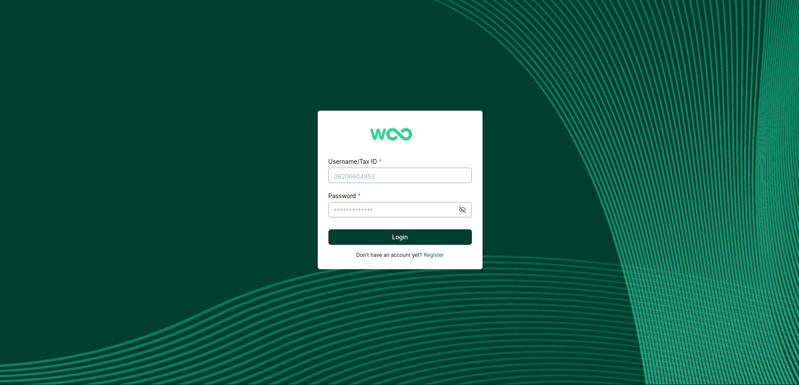
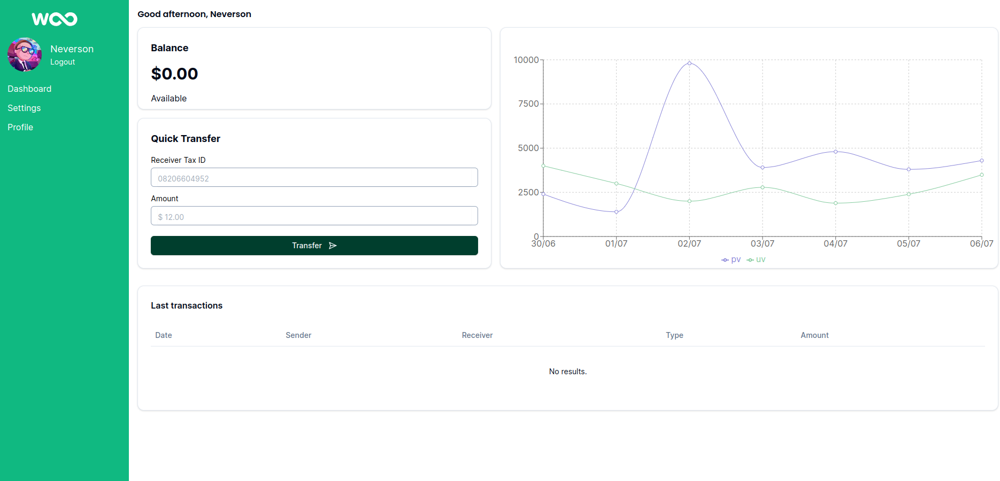

## Overview

This project is a solution for the Woovi Challenge, which involves building a simple CRUD (Create, Read, Update, Delete) application for a bank. The implementation utilizes the specified stack and technologies, closely mirroring day-to-day operations at Woovi.

## Stack

### Backend
- Node.js
- Koa.js
- MongoDB
- GraphQL

### Frontend
- React
- Relay

### Testing
- Vitest

## Features

- **User Registration and Login:**
  - Register a new user with a first name, tax ID (CPF/CNPJ), and encrypted password.
  - Unique tax ID enforcement to prevent duplicate registrations.
  - Login mutation with JWT token authentication.

- **Account Management:**
  - Create a user account with a unique account number.
  - Ensure one account per user.
  - Calculate account balance using a ledger strategy.

- **Transactions:**
  - Send and receive transactions between accounts.
  - Idempotent transaction handling to prevent duplicates.
  - Track sender and receiver details and transaction value.